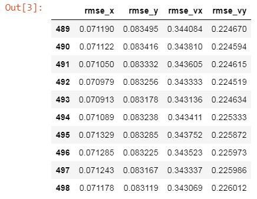
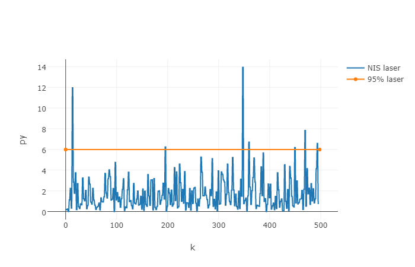
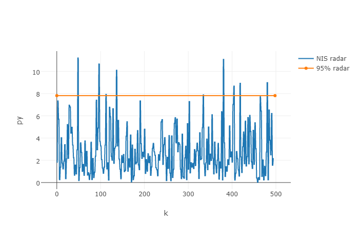

### Sefl-Driving Car Nanodegree Program. Term 2

## Project 7: Unscented Kalman Filter

### Overview
---
The goal of this project is to create a kalman filter to estimate the state of a moving object of interest with noisy lidar and radar measurements.

The project includes following steps:
* Completion of the [project template](https://github.com/udacity/CarND-Unscented-Kalman-Filter-Project) C++ sorce code in order to build an Unscented Kalman Filter (UKF) by applying the general processing flow as described in the class lessons
* Testing of the UKF code with input data generated by the [Term 2 Simulator](https://github.com/udacity/self-driving-car-sim/releases)
* Fine tuning of the process noise parameters `std_a_` and `std_yawdd_` using NIS
* Visualizion of the UKF output in a Jupyter notebook adopted from the provided in the [Sensor Fusion utility repo](https://github.com/udacity/CarND-Mercedes-SF-Utilities)

### Project directory content:

* [README.md](README.md) - This file.
* [src/](src/) folder:
   - project C++ souce code files
   - [CMakeLists.txt](src/CMakeLists.txt) - `cmake` input file to generate the project `Makefile`. It was moved to the `src` folder and adopted to generate an `Eclipse` project - thanks to [Eclipse IDE profile](https://github.com/udacity/CarND-Extended-Kalman-Filter-Project/tree/master/ide_profiles/Eclipse) repo for provided instructions. 
* [data/](data/) folder:
    - [ukf-visualization.ipynb](data/ukf-visualization.ipynb) - an IPython notebook for the output data visualization and analysis.
    - [ukf_output.txt](data/ukf_output.txt) - output data file generated by the project code
    - [UKF_estimate.png](data/UKF_estimate.png) - the output image generated by the notebook 

### Project Environment

The project code was built and executed on a Linux VMware guest.

### Project Build instructions

1. Make a build directory: `mkdir build && cd build`
2. Compile the code: `cmake ../src/ && make` (Please note that `CMakeList.txt` file is located in folder `src/`)
3. Run the code: `./ExtendedKF`

### Project results

The source file [main.cpp](src/main.cpp) was modified to store the output data records in a text file [ukf_output.txt](data/ukf_output.txt) in the following format:
`est_px est_py est_vx est_vy meas_px meas_py gt_px gt_py gt_vx gt_vy RMSE(0) RMSE(1) RMSE(2) RMSE(3)`

After processing the output file in the [ukf-visualization.ipynb](data/ukf-visualization.ipynb) notebook the object position estimates look as following:

The below table shows the position and velocity acccuracy of the last 10 estimates:

The uncertainty of the filter estimated by calculated NIS values is shown in the below plots for laser

and the radar

correspondently.

### Issues

When executed on Linux VM, an error `"Segmentation fault (core dumped)"` is reported after `h.onDisconnection()` call.
